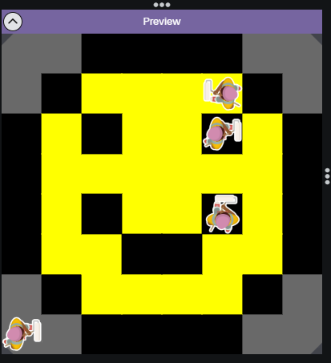

# asphalt-art-project
# Unit 1 - Asphalt Art

## Introduction

Cities use asphalt art to improve public safety, inspire their residents and visitors, and brighten communities. Your goal is to create asphalt art to revitalize The Neighborhood and bring the community together with the help of the Painter.

## Requirements

Use your knowledge of object-oriented programming, algorithms, the problem solving process, and decomposition strategies to create asphalt art:
- **Create a new subclass** – Create at least one new subclass of the PainterPlus class that is used for a component of the asphalt art design.
- **Plan an algorithm** – Use the problem solving process and decomposition strategies to plan an algorithm that incorporates a combination of sequencing, selection, and/or iteration.
- **Write a method** – Write at least one method in a PainterPlus subclass that contributes to a component of the asphalt art design.
- **Document your code** – Use comments to explain the purpose of the methods and code segments.

## Notes: Neighborhood & Painter Class

This project was created on Code.org's JavaLab platform using the built-in Neighborhood GUI output. To test and edit this project you must build in Code.org's JavaLab with the Neighborhood GUI enabled. For reference to the Painter class documentation, [you can read more here.](https://studio.code.org/docs/ide/javalab/classes/Painter)

## Output:
Sketch:

Final:

## Reflection

1. Describe your project.

My project is a program built within Code.org's JavaLab which uses multiple painter objects each, which are different subclasses of the same superclass of painterPlus, written within the program. These objects then each paint different components of a smiley face image such as the background, the eyes, the mouth, and the color of the face, to construct a digital image of a smiley face.

2. What are two things about your project that you are proud of?

Two things about my project that I am proud of include my choice subject and my general excecution. I'm very happy that I chose a simple image to create, in addition to the fact that I was able to go through the process of writing code relatively fluidly without having any major roadblocks. 

3. Describe something you would improve or do differently if you had an opportunity to change something about your project.

If had the opprotunity to do something differently in my project it would be the act of choosing a simpler and easier image to create, such as the flag of france. Though I used a simple image, I believe that I could have selected one that was even simpler.

4. How is this project related to STEAM (Science, Technology, Engineering, Art, and Mathematics)? Provide explicit examples from the project and details as possible. 

This project is rooted in STEAM as it presents aspects of Science, Technology, Engineering, Art, and Mathematics. This project is related to Science, Technology, Engineering, and Mathematics because it required code to be written, which is a skill and component that is used in modern day Technology, Engineering, Science, and Mathematics. The project is also related to Art because it is focused around creating a visual image, just as in many mediums of art one uses a medium to create something that a consumer of art takes in.

5. What SLOs did you demonstrate during completing this project?

During this project I demonstrated the SLOs of being a critical thinker and self-directed goal-oritnted individual by not only using critical thinking skills to solve problems while having an independent and directed mindset towards efficiently finishing the project.